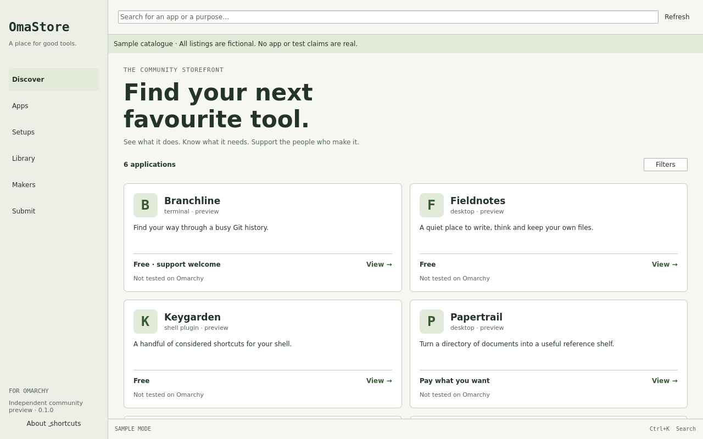

# OmaStore

A native community application storefront for Omarchy. Discover useful software, understand what it needs and support the people who make it.

OmaStore runs in its own Qt Quick window with a Rust core. The current preview includes search, app and maker pages, editorial stories, release feeds, selective setups, evidence labels, cached browsing and a local library. It can review exact package plans, rehearse independent installation/removal workers, reconcile interruptions and preview diagnostic exports. The native author workspace supports private drafts, media, exact previews, independent review and publication recovery. Selective settings have explicit diffs, consent and conflict-aware restore; local remixes retain attribution. Purchases support durable receipts, offline perpetual licences, subscription cycles, cancellations and refunds, with separate author finance and operator support records. Desktop colour scheme and text scaling follow the settings portal.

**Development preview.** The ordinary build includes six real applications indexed from Omarchy’s stable x86_64 package repository: OmaCalc, OmaCut, OmaWrite, OmaPresent, LocalSend and Heroic Games Launcher. These community entries have unclaimed makers and no OmaStore runtime test or screenshot claims. A separate demo build contains six explicitly fictional listings for exercising the interface. The demo also supports fictional author/reviewer/operator sessions and a local publication rehearsal. Real provider integration and Omarchy desktop evidence remain release gates; live package writes remain disabled until actual Omarchy lifecycle evidence is recorded. Selective settings/remixes and the full fictional commerce lifecycle are implemented. Live setting adapters and real payments remain separately gated.



## Build and try it on Omarchy

For the real repository preview, use the ordinary `dev` build below. The `demo` build remains the separate fictional playground. The [repository preview guide](docs/REPOSITORY_PREVIEW.md) explains the first desktop exercise.

Requirements: Linux, Qt 6.4+, CMake 3.22+, Ninja, C++17 and the pinned Rust toolchain. Bring Omarchy up to date using its normal updater first. On Omarchy/Arch:

```sh
sudo pacman -S --needed base-devel cmake ninja qt6-base qt6-declarative qt6-shadertools qt6-svg qt6-tools qt6-wayland xdg-desktop-portal rustup python
rustup show
./bin/build demo
./build-demo/bin/omastore --demo
```

For the ordinary build, with no synthetic catalogue embedded:

```sh
./bin/build dev
./build/bin/omastore
```

Both executables, `omastore` and `omastore-core`, must stay together. No browser runtime, web frontend, local server or cloud account is required to open the app. External seller/source actions open the system browser. Refresh reads only the configured public catalogue origin; a failed refresh keeps the last valid view. Public delivery uses the separate `catalogue-live` branch after the publication authority verifies the exact approved content.

`Ctrl+K` or `Ctrl+F` focuses search, `Alt+Left`/`Escape` leaves app detail, `Ctrl+R` refreshes and `Ctrl+Q` quits. App cards and actions support keyboard focus/Space activation. Filters and saved items persist locally; sample mode uses separate preferences.

See [the native playground walkthrough](docs/PLAYGROUND.md) for discovery, setups, settings, submissions, purchases, refunds and provider scenarios.

## Prepare a listing

Open **Submit → Author workspace** for private versioned drafts, media uploads, exact preview and independent review. The demo provides fictional sessions to exercise this flow locally. Configure the optional service for real accounts; see [author service](docs/AUTHOR_SERVICE.md), [review operations](docs/REVIEW_OPERATIONS.md) and [publication](docs/PUBLICATION.md).

The **Local worksheet** tab prepares one local worksheet. Save partial work on this device, check fields, inspect the exact candidate and export through the native file dialog. Another window's edits cannot be silently overwritten. Closing with unsaved work asks whether to save or discard it.

An export is a development candidate, with an unclaimed maker and no compatibility evidence. It is not submitted, approved or published. The initial form prepares one external route and one offer; the author workspace handles media, full listing fields, immutable revisions and review evidence. Free submissions and 0% OmaStore fees on external author sales/support remain the product policy.

## Verify and package

```sh
./bin/test demo
cargo run --locked --bin omastore-validate -- data/registry.json
cmake --install build --prefix "$PWD/build/stage"
```

Checks cover catalogue/price/evidence contracts, cache preservation, actual Rust HTTP/core parity, native keyboard flows at three logical sizes and 200% scaling, media decoding/digests, local worksheet recovery/conflicts and public-build fixture exclusion. Offscreen checks do not establish real Omarchy/Wayland/portal or assistive-technology behaviour. [The handoff](docs/BUILD_HANDOFF.md) records those remaining gates.

`packaging/PKGBUILD` is a local source-checkout recipe: run `makepkg` from `packaging` on Arch after reviewing it. It has not been built on Arch here and does not imply AUR or Omarchy repository inclusion. CMake installs the app/core, desktop entry, AppStream metadata and licence. `BUILD_TESTING=OFF` excludes the Qt test harness; development data is off by default. The standard `system-software-install` theme icon remains provisional.

The optional read service can be run with `./build/bin/omastore-service data/registry.json 127.0.0.1:8080`. Without a private database it serves public catalogue reads. Add the documented workspace/provider configuration for authenticated workflows, release feeds and operational status. Remote deployment needs an operator-managed HTTPS proxy. See [API and cache contracts](docs/API.md).

## Product and implementation

- [Product specification](docs/PRODUCT_SPEC.md): complete native product and monetisation contracts.
- [Bundle status](docs/BUNDLE_STATUS.md) and [build handoff](docs/BUILD_HANDOFF.md): implemented work, validation and remaining gates.
- [Catalogue contract and submission example](docs/CATALOGUE.md).
- [Native conventions and delivery decisions](docs/adr/0002-native-discovery.md), grounded in pinned Omawrite/Omacalc sources.
- [Local author preparation](docs/adr/0003-local-author-preparation.md): scope and the boundary with future authenticated submissions.
- [Contributing](CONTRIBUTING.md) and [submissions](SUBMISSION.md).
- [Standalone note to DHH](docs/DHH_NOTE.md), prepared for Tom and unsent.

The scoped software bundles B00–B22 are implemented, including operations/readiness, selective settings, attributed remixes and optional managed commerce. The playground runs locally. Real Omarchy, publisher/pilot and payment-provider evidence remain release gates; the handoff records the exact checks and limits.

Independent community project. No official Omarchy endorsement is implied. Project code is MIT licensed; Qt, upstream applications and media retain their own licences.
