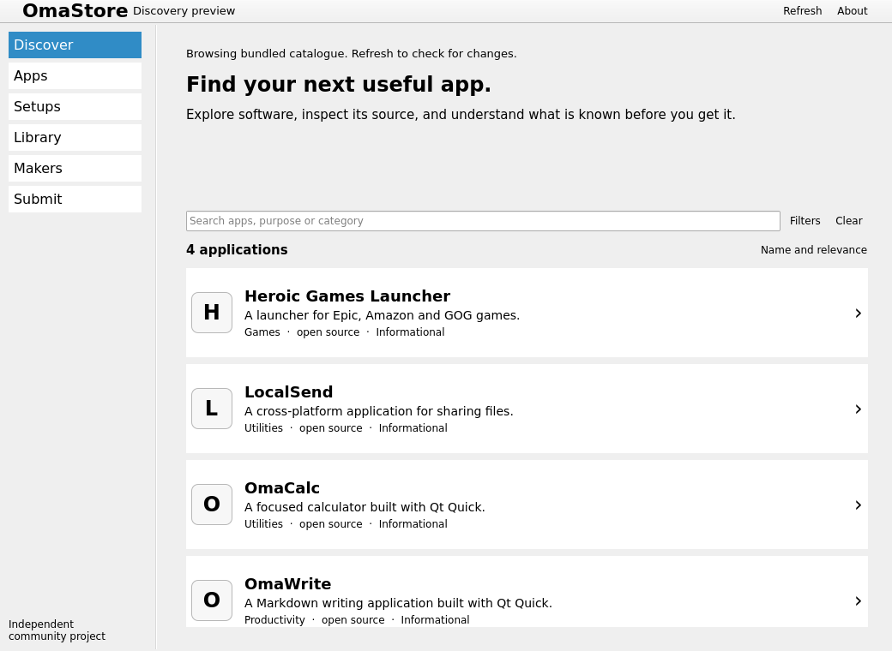

# OmaStore

A native application storefront for Omarchy.

The aim is to discover useful software, understand what it does, support its makers and adopt selected parts of a shared setup. OmaStore opens in its own Qt/QML desktop window, backed by a Rust core.

**Current state: native discovery preview.** Search and filter four real informational
package listings, inspect app details and exact package provenance, and follow external
project/package links. The Rust core supplies a shared read contract and last-valid
catalogue cache. Search filters survive navigation and restart.

Listings are not approved submissions or compatibility claims. Package availability
on the current machine has not been scanned. Managed installation, installed-app
library, author submissions and payments remain unimplemented.



## Build and run

Requirements: Linux, Qt 6.4+ with Quick/Quick Controls/QML development files, CMake 3.22+, Ninja, a C++17 compiler, Python 3.10+ for process tests and Rust via rustup. The repository pins Rust in `rust-toolchain.toml` and dependencies in `Cargo.lock`.

On Omarchy/Arch, install the development prerequisites through the normal system package manager:

```sh
sudo pacman -S --needed base-devel cmake ninja qt6-base qt6-declarative qt6-shadertools qt6-svg qt6-tools qt6-wayland rustup python
rustup show
cmake --preset dev
cmake --build --preset dev
./build/bin/omastore
```

The program locates `omastore-core` alongside the desktop executable. CMake builds and places both in `build/bin`. It uses Qt's normal platform selection on a Wayland desktop; no browser, webview or running catalogue service is needed for bundled or cached browsing.

## Check discovery

```sh
cargo fmt --all -- --check
cargo clippy --workspace --all-targets --locked -- -D warnings
cargo test --workspace --locked
ctest --preset dev
```

CTest covers the actual Rust child process and an offscreen Qt startup/core handshake. Offscreen Linux checks do not establish accessibility, launcher behaviour or compatibility on a real Omarchy desktop. Those observations remain recorded separately in [the handoff](docs/BUILD_HANDOFF.md).

To rehearse packaging without changing the machine:

```sh
cmake --install build --prefix "$PWD/build/stage"
```

The desktop entry uses the standard `system-software-install` theme icon while product artwork remains undecided. It does not register an install URI handler; that arrives with a reviewed native handoff implementation.

## Continue the build

- [Product specification](docs/PRODUCT_SPEC.md): native product, submission and author-income contracts.
- [Bundle status](docs/BUNDLE_STATUS.md): implementation order and evidence.
- [Build handoff](docs/BUILD_HANDOFF.md): current state and next work.
- [Native architecture](docs/adr/0001-native-first.md): Qt/QML, Rust and process boundary.
- [Contributing](CONTRIBUTING.md) and [submissions](SUBMISSION.md).

Catalogue v1 and its [validator](docs/CATALOGUE.md) are implemented. The read service, native cache and discovery views are implemented. See [verification and provenance](docs/evidence/README.md) for the remaining real-desktop and HTTPS integration checks. Keep the storefront native. Shared catalogue and author services support it; a web storefront is outside the initial build.

Independent community project. No official Omarchy endorsement is implied. Project code is MIT licensed; upstream applications, Qt and future catalogue media retain their own licences.
